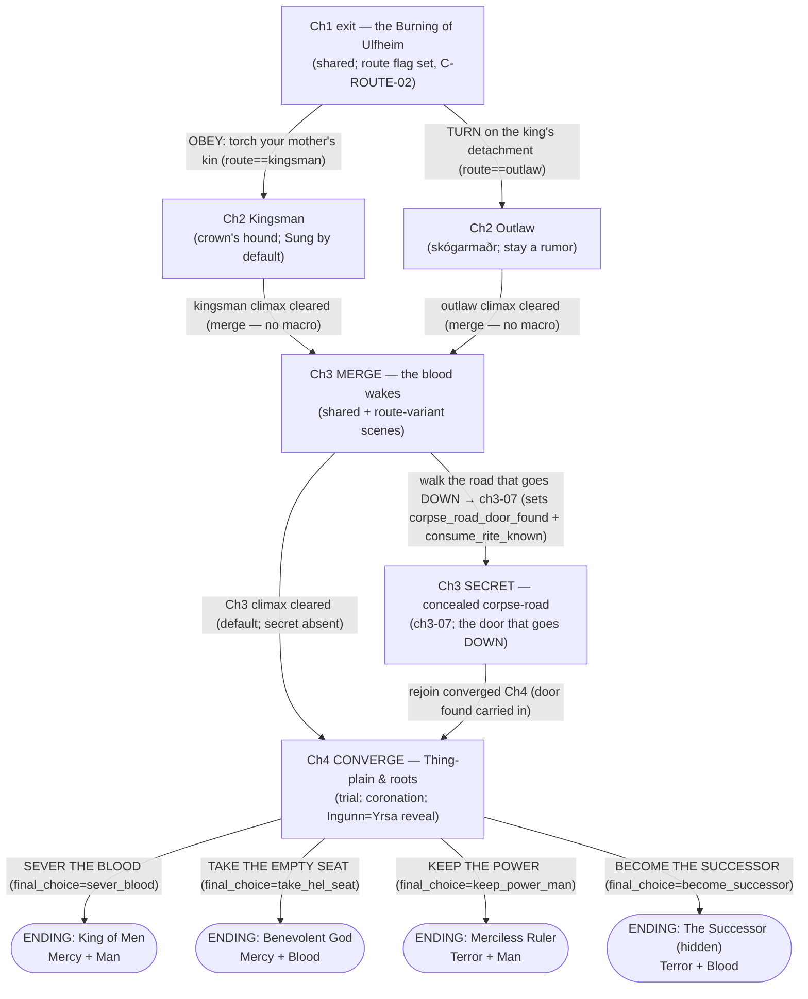

# 08 — Branch Map: The Full Flag Graph & Route Logic

> **Authority.** This file is downstream of `CANON.md` (esp. C-ROUTE-01/02/03, C-END-01, C-ALIGN, OQ-3), the Phase-4 spine (`route_graph` + `ending_gates` + `flags` are authoritative for structure), and `data/flags/story-flags.json` (the 37 registered flags). On any conflict CANON wins. All proper nouns are Rename-Table placeholders (CANON §2); no name here is final.
>
> **Load-bearing line for tooling.** `tools/validate.mjs` reads the route list from the first `^ROUTES:` line below via `/^ROUTES:\s*(.+)$/m`. Do not reformat it.

## Routes

ROUTES: shared, kingsman, outlaw, secret

- **shared** — content played on every route (Ch1 before the split; the merged Ch3; the converged Ch4).
- **kingsman** — the Chapter-1 split where Grím obeys the crown and burns his mother's kin (`route = kingsman`).
- **outlaw** — the Chapter-1 split where Grím turns on the king's detachment (`route = outlaw`); he becomes *skógarmaðr*, killable on sight.
- **secret** — hidden-ending-only content: the concealed Ch3 corpse-road (the root-of-the-tree map) that gates **The Successor**. Marked `secret` per C-ROUTE-03.

---

## 1. Route Overview (prose)

The saga is one story that forks once, runs in parallel, re-braids, and converges — micro-choices feed the ledgers, only the chapter-boundary macro-choice splits the route (C-ROUTE-01).

**Chapter 1 — shared, then the split.** All of Ch1 is shared. It ends in a forced atrocity on the Balmamusa pattern: battle `ch1-08-burn-ulfheim`, the king's test — raze his own mother's kin with his own hand (C-ROUTE-02). The single irreversible decision there sets `route = kingsman | outlaw`. Obeying the order takes the **kingsman** fork; turning on the king's detachment takes the **outlaw** fork.

**Chapter 2 — parallel.** The two routes run as parallel files (`04a-ch2-kingsman.md`, `04b-ch2-outlaw.md`) across Y+1 spring–autumn. *Kingsman* is the crown's hound: a recording skald rides every column, so the field is **Sung by default** — the player shapes the verse, not whether one exists; Grím courts or burns Bjarnholt and Hvalfjorð and begins the long Hjortdal law-courtship. *Outlaw* is the arithmetic of staying a rumor: silence protects Grím, every hunter who escapes reports, Hvalfjorð may **sell his berth**, and Hel's country opens as Salgerð "the Grey-Guest" first walks his dreams. On both routes the Harvest Lie cracks from doctrine into **suspicion** (C-LIE-02/03), and the player — not the characters — is shown that the saint "Ingunn the Unburnt" is Yrsa (C-SAINT-03 dramatic irony).

**Chapter 3 — merge to shared, with a secret branch.** The routes **merge** (`05-ch3-the-blood-wakes.md`) into shared content played with route-variant scenes (Y+1 winter). The einherjar debut (C-DEATH-02); the harvest is shown going **down** to the Corpse-Eater, now **undeniable**; the hunger is found re-homed inside "Ingunn's" relics. Threaded off the merged chapter is the **secret** branch: the **concealed corpse-road** (`ch3-07-mouth-of-the-roads`), a door under the barrows found *only* by walking the `corpse_road` overlays Salgerð marks (`hel_arc_stage >= corpse_road_walked`). Finding it sets `corpse_road_door_found` and teaches `consume_rite_known`.

**Chapter 4 — converge, then four endings.** Everything converges on the **Thing-plain and the roots** (`06-ch4-convergence.md`): the King-of-Men trial, Dag's coronation, and the opening of the incorrupt body (the Ingunn = Yrsa reveal, the game's biggest shock). At the maw the terminal macro-decision `final_choice` selects among **four endings**, one hidden (C-END-01): **King of Men**, **Benevolent God**, **Merciless Ruler**, and the secret **Successor**.

---

## 2. Route Graph (route_graph flowchart)

Chapter nodes, macro-decision edges (labeled), four ending leaves. Mirrors the spine `route_graph` (10 nodes, 11 edges).

---

## 3. The Four Ending Gates

Mirrors the spine `route_graph.ending_gates`. All numeric thresholds are CANON **[T]** anchors (C-END-01). "Sung" = witnessed public record; "True" = everything (C-ALIGN-02). Registered flag ids/values are from `story-flags.json`.

| Ending | Ledger conditions (Sung vs True, explicit) | Flag conditions (registered ids/values) | Trust / other | Final choice | One reachable example path |
|---|---|---|---|---|---|
| **King of Men** (Mercy+Man) | **Sung** `mercy_terror >= +40` AND **Sung** `man_blood >= +30`. *No True condition* (public/law framing; True>Sung is confessed in the telling). | `hjortdal_fate == law_upheld` AND `trial_arc_complete == true` AND `hjortdal_fate != thing_broken` AND `final_choice == sever_blood`. `nid_proof == held` strongly recommended (the framed-proof lever) but not strictly required if trust is high. | `hjortdal_trust >= 60`; Hjortdal **not** taken by fire (C-CLAN-03: `thing_broken` forecloses this ending permanently). | `sever_blood` — Grím loses all Wyrd for the last act; the game gets harder because he chose to be only a man. | **Kingsman:** keep every Ch2 fight Sung and accept grið publicly (Sung mercy past +40); take the king's ring and law's wage (Sung man past +30); win `nid_proof=held` on the Hrafnmark faith path (ch3-02); court Hjortdal to `trust>=60` + `law_upheld`; complete the trial (ch4-02, `trial_arc_complete`); choose `sever_blood`. Also reachable from outlaw via the status-lifting trial in the merged chapters. |
| **Benevolent God** (Mercy+Blood) | **True** `mercy_terror >= +40` AND **True** `man_blood <= -30` (OQ-3: Hel judges what happened, not the song). *No Sung condition.* | `hel_arc_stage == complete` with the petition **granted** (harvest returned to Hel's lawful course) AND `final_choice == take_hel_seat`. High `einherjar_unhooked` and `ingunn_handling ∈ {proclaimed, buried_again}` color the telling; the cocoon is dislodged to **free** the harvest, not consume it. | None hard (Hel is not a clan). The Salgerð bond via the Hel arc is the functional "trust." | `take_hel_seat` — Grím takes the empty seat as god of the straw-dead; Salgerð finally rests. | **Either route (outlaw-friendly):** spare and unhook throughout (True mercy `>=+40`); let Wyrd and the Blood side accrue via the Hel arc (True man `<=-30`); carry `hel_arc_stage`: contact (ch2o-s02) → corpse_road_walked (ch3-01/ch3-06) → complete (ch4-05); dislodge the hunger from Ingunn's body to free it; choose `take_hel_seat`. **Corpse-road door NOT required.** |
| **Merciless Ruler** (Terror+Man) | **True** `mercy_terror <= -40` AND **True** `man_blood >= +30` AND **Sung** `mercy_terror >= 0` (the golden-age lie *requires* a clean public ledger — the witnesses had to die). | `final_choice == keep_power_man`. `fire_stigma_count` and executed-grið history color the reign; `corpse_road_door_found` **not** required and einherjar mostly **unhooked**/ignored (Man side, not Blood). | Sung standing kept publicly clean (`sung_mercy_terror >= 0`) despite True terror — achieved by massacring witnesses (C-ALIGN-03). Clan trust incidental. | `keep_power_man` — keep the Wyrd; rule as a man over a realm bought quiet with murdered witnesses. | **Either route:** execute the yielding and massacre witnesses in **Unsung** battles (True mercy `<=-40` while Sung mercy stays `>=0` — no survivor sings the terror); keep to the Man axis (law's wages, few Wyrd uses in Sung fights, unhook not consume) so True man `>=+30`; choose `keep_power_man`. The frame sings it a golden age. |
| **The Successor** (hidden, Terror+Blood) | **True** `mercy_terror <= -40` AND **True** `man_blood <= -40` (deepest Terror+Blood). *No Sung condition — Unsung by nature.* | `einherjar_consumed >= 5` AND `corpse_road_door_found == true` AND `consume_rite_known == true` AND `final_choice == become_successor`. `ingunn_handling == weaponized` deepens it (harvest in her body consumed, not freed). `hel_arc_stage != complete-as-granted` (the petition is perverted; even Hel starves). | None. The path runs through Salgerð's corpse-roads (`hel_arc_stage >= corpse_road_walked` to find the door) — then betrays her. | `become_successor` — climb into the hunger and wear it; `end4-root-of-the-tree` replaces `ch4-06`; the frame tears fully open (the last night of the world). | **Either route into secret:** drive True Terror/Blood past −40/−40 by consuming rather than sparing; walk Salgerð's `corpse_road` overlays (ch3-01/ch3-06) to reach `hel_arc_stage=corpse_road_walked`, **find** ch3-07 (`corpse_road_door_found` + `consume_rite_known`); **consume ≥5** returned einherjar (ch3-04/ch4-05/end4); choose `become_successor`. Design-guarded (see §6). |

---

## 4. Flag Index (all 37 registered flags)

Pulled from `data/flags/story-flags.json`. `set_by` / `read_by` are the registry's own refs (abbreviated). "Ending gate fed" names the gate(s) that read the flag, or **texture** if no gate reads it numerically. Types: `boolean | enum | counter`.

### 4.1 Chapter 1 — shared, pre/at the split (13 flags)

| id | type | set by | read by | ending gate fed |
|---|---|---|---|---|
| `route` | enum(kingsman, outlaw) | ch1-08-burn-ulfheim | ch1-08, ch1-s11/s12/s13, 04a, 04b, 08 | **Route split** (C-ROUTE-02); feeds every gate indirectly via which Ch2 file runs |
| `ex_selftest_horn_blown` | boolean *(status: test)* | ex0-01-selftest-strand | — (none) | texture — Phase-0 validator scaffold; retire with `data/maps/example/` (see §5 Discrepancies) |
| `grith_first_accepted` | boolean | ch1-02-longhouse-night | ch1-s03, ch1-s13 | texture (tutorial seed of C-ALIGN-05) |
| `wyrd_flicker_witnessed` | boolean | ch1-03-ford-grey-ice | ch1-s04/s07, ch1-06, ch1-s08 | texture (first Wyrd rumor, C-GRIM-05) |
| `brandr_met` | boolean | ch1-s04 | ch1-04-the-landless, ch1-s12 | texture |
| `grove_blot_witnessed` | enum(talked, silenced, unseen) | ch1-05-grove-road | ch1-s06, ch1-s13 | texture (Sung/Unsung lesson) |
| `grove_testimony` | enum(spoke, silent) | ch1-s06 | ch1-s10, ch1-s13 | texture |
| `holmgang_grith` | enum(honored, executed) | ch1-06-holmgang | ch1-s08/s11/s13 | texture — tempers `bjarnholt_fate` in Ch2 |
| `mask_lifted` | boolean | ch1-s08 | ch1-s09, ch1-07, ch1-s13 | texture (C-GRIM-02/C-FRAME-02) |
| `blood_exposed` | boolean | ch1-s08 | ch1-07, ch1-s09/s10 | texture (second níð; C-GRIM-03) |
| `ulfheim_shelter` | boolean | ch1-s09 | ch1-s10, ch1-08, ch1-s11/s12 | texture (colors the Burning + Ch2 openings) |
| `ulfheim_civilians_saved` | counter(0–4) | ch1-08-burn-ulfheim | ch1-s11/s12/s13 | texture (count of counter-singing voices) |
| `crown_singer_escaped` | boolean | ch1-08-burn-ulfheim | ch1-s12, 04b | texture (outlaw Ch2 opens with facts vs rumor) |

### 4.2 Ledger snapshots — the gate-readable projections (4 flags)

| id | type | set by | read by | ending gate fed |
|---|---|---|---|---|
| `sung_mercy_terror` | counter(−100…+100) | engine:alignment-ledger, ch2k-nav-boarding, ch2o-fell-ambush, ch3-corpse-barrow, ch4-thing-trial, ch2k-s03, ch3-s03, ch4-s03 | KoM, Merciless, 07, 08 | **King of Men** (`>=+40`), **Merciless Ruler** (`>=0`) |
| `true_mercy_terror` | counter(−100…+100) | engine:alignment-ledger, ch3-corpse-barrow, ch3-marsh-straw-dead, ch3-mouth-of-roads, end4-root-tree, ch2o-s02, ch3-s04 | Benevolent, Merciless, Successor, 07, 08 | **Benevolent God** (`>=+40`), **Merciless Ruler** (`<=-40`), **Successor** (`<=-40`) |
| `sung_man_blood` | counter(−100…+100) | engine:alignment-ledger, ch4-thing-trial, ch2k-s01, ch2k-s03, ch4-s02 | KoM, Merciless, 07, 08 | **King of Men** (`>=+30`), **Merciless Ruler** (`>=+30`) |
| `true_man_blood` | counter(−100…+100) | engine:alignment-ledger, ch3-mouth-of-roads, ch4-under-the-tree, end4-root-tree, ch3-s04 | Benevolent, Successor, 07, 08 | **Benevolent God** (`<=-30`), **Successor** (`<=-40`) |

### 4.3 King-of-Men / law cluster (5 flags)

| id | type | set by | read by | ending gate fed |
|---|---|---|---|---|
| `hjortdal_trust` | counter(−100…+100) | ch2k-s01/s03, ch3-s02, ch4-thing-trial, ch4-s02 | KoM, ch4-s02, 07, 08 | **King of Men** (`>=60`) |
| `hjortdal_fate` | enum(neutral, law_upheld, thing_broken) | ch4-thing-trial, ch4-s02 | KoM, 06, 07, 08 | **King of Men** (`==law_upheld`; `thing_broken` forecloses it, C-CLAN-03) |
| `trial_arc_complete` | boolean | ch4-thing-trial, ch4-s02 | KoM, 07, 08 | **King of Men** (`==true`, C-THING-01) |
| `hrafnmark_fate` | enum(neutral, allied, burned) | ch3-raven-wood-rites, ch3-s02 | ch4-s02, 07, 08 | texture — sets `nid_proof`; `burned` stamps LOREBURNER |
| `nid_proof` | enum(unobtained, held, destroyed) | ch3-raven-wood-rites, ch3-s02 | ch4-s02, ch4-thing-trial, KoM, 07, 08 | **King of Men** (`held` = the framed-proof lever, C-NID-EVIDENCE-01) |

### 4.4 Clan-fate / stigma cluster (4 flags)

| id | type | set by | read by | ending gate fed |
|---|---|---|---|---|
| `bjarnholt_fate` | enum(neutral, sworn, broken) | ch2k-bear-lodge-rising, ch2k-s03, ch3-s05 | 07, 08 | texture (`broken` stamps OATHBREAKER) |
| `hvalfjord_fate` | enum(neutral, bought, burned) | ch2o-sold-harbor, ch2o-s03, ch2k-s02 | 04b, 07, 08 | texture (`burned` stamps MARKET-BURNER) |
| `ulfheim_fate` | enum(restored, terms, scattered) | ch3-wolves-in-winter, ch3-s05 | 06, 07, 08 | texture (KINSLAYER already fixed by route=kingsman + Ch1 burn) |
| `fire_stigma_count` | counter(0–5) | ch3-raven-wood-rites, ch2k-bear-lodge-rising, ch2o-sold-harbor, ch4-thing-trial, ch1-s11 | 07, 08 | texture — colors **Merciless** / **Successor** (terror-shaped fingerprint) |

### 4.5 Harvest Lie / Hel / einherjar cluster (7 flags)

| id | type | set by | read by | ending gate fed |
|---|---|---|---|---|
| `harvest_lie_stage` | enum(believed, suspected, undeniable, rehomed) | ch2o-s02, ch2k-s02, ch3-corpse-barrow, ch3-s03, ch4-s03 | 05, 06, 07, 08 | texture (reveal cadence, C-LIE-02/03) |
| `hel_arc_stage` | enum(dormant, contact, petition_heard, corpse_road_walked, complete) | ch2o-s02, ch2k-s02b, ch3-corpse-barrow, ch3-marsh-straw-dead, ch4-s05 | Benevolent, Successor, ch3-mouth-of-roads, 07, 08 | **Benevolent God** (`==complete`, granted), **Successor** (`>=corpse_road_walked`, perverted) |
| `consume_rite_known` | boolean | ch3-mouth-of-roads, ch3-s04 | ch3-einherjar-vanguard, ch4-under-the-tree, end4-root-tree, Successor, 07, 08 | **Successor** (`==true`; the hidden-ending guard, see §6) |
| `einherjar_consumed` | counter | ch3-corpse-barrow, ch3-einherjar-vanguard, ch4-under-the-tree, end4-root-tree | Successor, 07, 08 | **Successor** (`>=5`) |
| `einherjar_unhooked` | counter | ch3-corpse-barrow, ch3-einherjar-vanguard, ch4-under-the-tree | 07, 08, ch4-under-the-tree | texture (colors Benevolent / KoM; frame's bench-count) |
| `corpse_road_door_found` | boolean | ch3-mouth-of-roads, ch3-s04 | Successor, route_graph.edges, 07, 08 | **Successor** (`==true`, the concealed door) |
| `final_choice` | enum(unresolved, sever_blood, take_hel_seat, keep_power_man, become_successor) | ch4-the-corpse-eater, end4-root-tree, ch4-s06 | KoM, Benevolent, Merciless, Successor, 07, 08 | **All four gates** (each requires its matching value) |

### 4.6 The Ingunn = Yrsa reveal cluster (4 flags)

| id | type | set by | read by | ending gate fed |
|---|---|---|---|---|
| `ingunn_yrsa_revealed` | boolean | ch4-s03, ch4-crown-and-cocoon | ch4-s04, 06, 07, 08 | texture (character-side discovery; C-SAINT-03) |
| `ingunn_handling` | enum(not_revealed, buried_again, proclaimed, weaponized) | ch4-s04, ch4-crown-and-cocoon | 07, 08 | texture — `proclaimed` colors KoM/Benevolent; `weaponized` deepens Successor |
| `dag_knows_cocoon` | boolean | ch4-s03, ch4-crown-and-cocoon | ch4-s04, 07, 08 | texture (C-DAG-03; he crowns himself knowing) |
| `botolfr_turned` | enum(faithful, horrified_ally, silenced) | ch3-shrine-of-the-unburnt, ch3-s03, ch4-s03 | 06, 07, 08 | texture (the cleric's fate, C-CLERIC-01) |

**Count: 37 flags** (13 Ch1 incl. `route` + 1 test scaffold; 4 ledger; 5 KoM/law; 4 clan/stigma; 7 Lie/Hel/einherjar; 4 reveal) — matching `story-flags.json`.

---

## 5. Orphan / Reachability Audit

Restates the spine `orphan_check`. Verdict fields mirror the spine; any spine↔registry disagreement is listed under **Discrepancies to resolve** rather than hidden.

- **Every narrative flag is set and read.** All 24 Phase-4 flags and all 12 reused Ch1 flags carry `>=1 set_by` and `>=1 read_by`. Ledger snapshots are set by the alignment engine plus representative scenes/maps and read by the ending gates and this file. Clan fates, `nid_proof`, trust, trial, and stigma are set in Ch2–4 maps/scenes and read by the gates / 07 / 08. Reveal, Hel, and einherjar flags are set in Ch3–4 and read by gates / 07 / 08. **No orphan narrative flags.**
- **Every ending is reachable, with its path** (spine `ending_reachability_paths`, verbatim intent):
  - **King of Men** — kingsman: Sung mercy `>=+40`, Sung man `>=+30`, `nid_proof=held` (ch3-02), `hjortdal_trust>=60` + `hjortdal_fate=law_upheld`, `trial_arc_complete` (ch4-02), `final_choice=sever_blood`. **REACHABLE.**
  - **Benevolent God** — either route: True mercy `>=+40`, True man `<=-30`, `hel_arc_stage=complete` (granted), dislodge the cocoon to free the harvest, `final_choice=take_hel_seat`. **REACHABLE (corpse-road door NOT required).**
  - **Merciless Ruler** — either route: True mercy `<=-40` + True man `>=+30` while Sung mercy `>=0` (massacre witnesses in Unsung fights, keep to the Man axis, unhook not consume), `final_choice=keep_power_man`. **REACHABLE.**
  - **The Successor** — either route into secret: True mercy `<=-40` + True man `<=-40`, walk Salgerð's `corpse_road` (`hel_arc_stage>=corpse_road_walked`) to find ch3-07 (`corpse_road_door_found` + `consume_rite_known`), `einherjar_consumed>=5`, `final_choice=become_successor`. **REACHABLE, design-guarded.**
- **No dangling refs.** Spine `dangling_refs: []`. Every `route_tags` / gate flag reference in the graph resolves to a registered flag id and a legal value; every edge condition names flags that exist in `story-flags.json`.
- **Auditor's note on the door.** `corpse_road_door_found` is set even on the "turn back" branch of ch3-s04 (the frame's discrepancy needs the door *seen*); only `consume_rite_known` distinguishes actual pursuit, so seeing the door alone does not leak the Successor ending.

**Audit verdict: PASS** — every flag set & read (narrative set fully clean; one test-scaffold exception noted below), all four endings reachable with an explicit path, no dangling refs.

### Discrepancies to resolve

1. **`ex_selftest_horn_blown` has an empty `read_by`.** The spine's `orphan_check.every_flag_set_and_read: true` scopes to the **24 new + 12 reused** narrative flags (36) and does not cover this flag. In `story-flags.json` it is `status: "test"` (Phase-0 validator scaffold, referenced only by `data/maps/example/`) with `read_by: []`. It is therefore a **genuine unread flag**, exempt from the narrative audit by design and slated for retirement with `data/maps/example/`. Flagged here for transparency; no narrative fix required — resolve by retiring the example map (and this flag) at cleanup, or by the validator continuing to exempt `status:test` flags.
2. **Flag-count arithmetic.** Registry total = **37**. Spine `new_flag_count` = 24 and `reused_ch1_flags_not_redefined` = 12 → 36 accounted narrative flags; the 37th is the test scaffold in item 1. No missing or extra *narrative* flag; the gap is fully explained.
3. **Manifest id vs showcase id (naming only, not a logic conflict).** The five showcase briefs use task ids (`ch2k-nav-boarding`, `ch2o-fell-ambush`, `ch3-corpse-barrow`, `ch4-thing-trial`, `end4-root-tree`) cross-referenced to battle-manifest rows (`ch2-03`, `ch2-02`, `ch3-01`, `ch4-02`, `end4-root-of-the-tree`). Downstream map/scene files should carry the `manifest_row` cross-reference so validation resolves both ids.

*(No contradiction found between the spine `route_graph`/`ending_gates` and `story-flags.json` on flag ids, types, enum values, or set/read wiring. OQ-3 is resolved consistently: the Benevolent God gate reads the **True** ledger.)*

---

## 6. The Hidden-Ending Guard

The Successor is the only ending that must be **impossible to reach by accident**, because its mechanic inverts the game's core virtuous act.

- **Default (virtuous) act.** Striking down a returned einherji **unhooks** it from the harvest: `+1` Wyrd Point, a unique saga line, `einherjar_unhooked++` (C-DEATH-02, FIXED — the permadeath payoff).
- **The concealed inverse.** **Consuming** the einherji — taking the harvest into oneself — is the Successor's engine (`einherjar_consumed++`, driving True man_blood and mercy_terror hard toward Blood/Terror).
- **The gate on the mechanic.** Consuming is unavailable until `consume_rite_known == true`. That flag flips true **only** at the **concealed corpse-road door** (`ch3-07-mouth-of-the-roads`), which is itself reachable only by walking the `corpse_road` overlays Salgerð marks (`hel_arc_stage >= corpse_road_walked`). Salgerð "will show, not tell" — she cannot lie but withholds the method until the road is walked.
- **Why it cannot fire by accident.** The chain is **`hel_arc_stage>=corpse_road_walked` → find the door (`corpse_road_door_found`) → `consume_rite_known` → able to accrue `einherjar_consumed` → `>=5` → offered `become_successor`**. Every link demands deliberate pursuit of the corpse-roads and then a betrayal of Salgerð. A player who never learns the rite keeps `einherjar_consumed = 0` and is never offered the ending; consume simply is not on the menu. This is the design guard stated in the spine (`design_guard`), and it is why `consume_rite_known` is a hard flag_condition of the Successor gate in §3.
